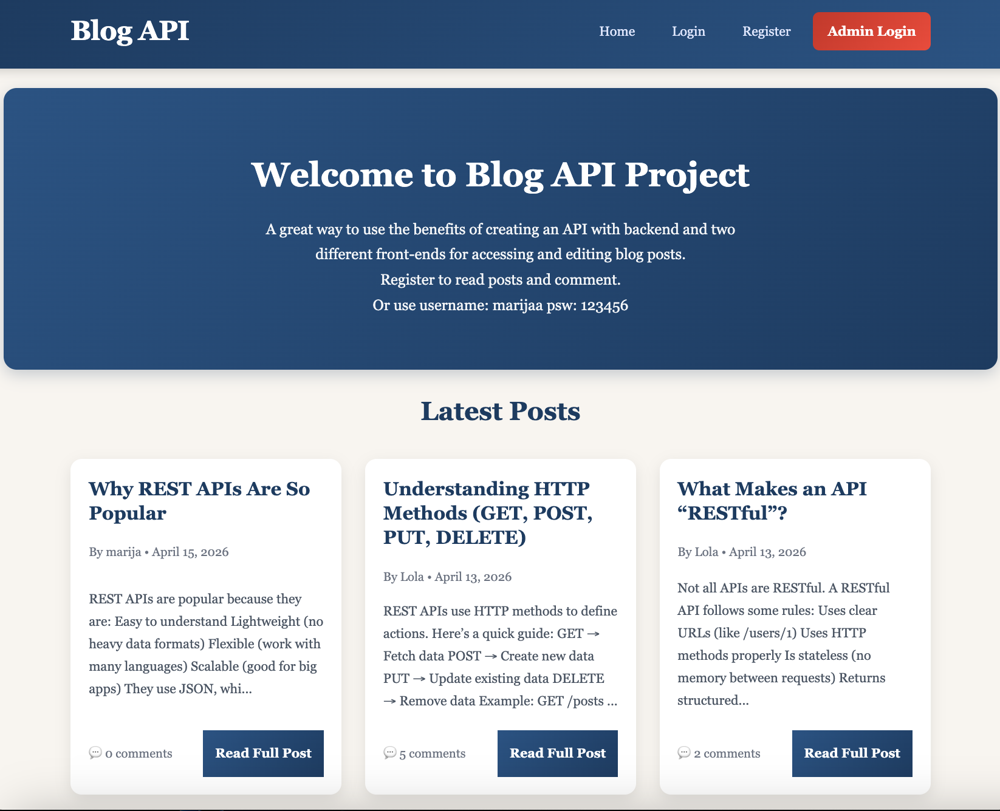
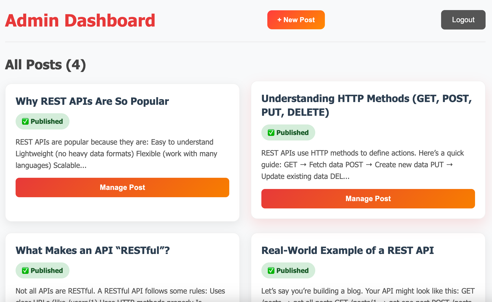

# blog-public

App runs on:
https://marijaavramovic.github.io/blog-public/

Frontend for Admin runs on:
https://blog-admin-marijaa.netlify.app/
 

Backend API is running on:
https://blog-api-wwtw.onrender.com/

Separate GitHub repos for each of the three apps:

 Public: https://github.com/MarijaAvramovic/blog-public (current)

 Admin: https://github.com/MarijaAvramovic/blog-admin

 API: https://github.com/MarijaAvramovic/blog-api

 

A simple and responsive public blog website where users can read posts and leave comments.

This app connects to the Blog API and displays published posts only.

🚀 Features
📄 View all published blog posts
🔍 Open single post pages
💬 Add comments with a username
📅 Display timestamps for posts and comments
📱 Responsive design
🛠️ Tech Stack
Vanilla (or HTML/CSS/JS)
Fetch API
CSS  

 